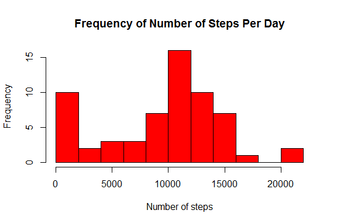
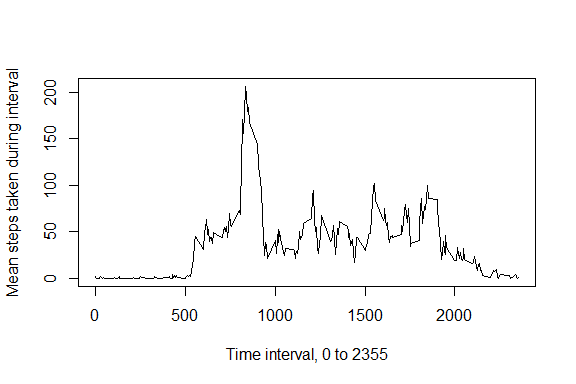
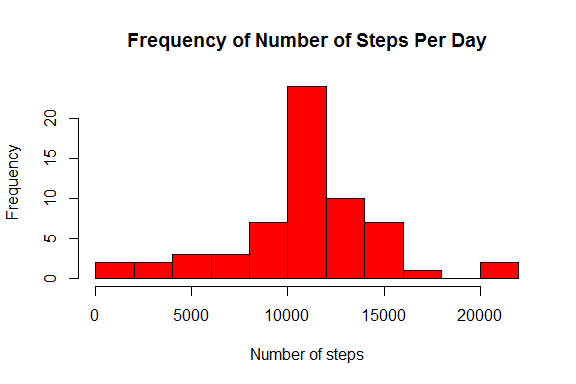
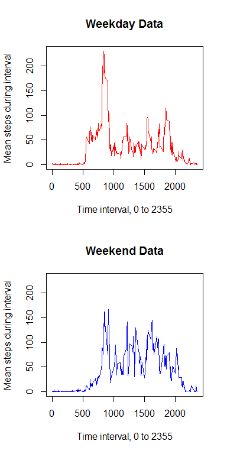
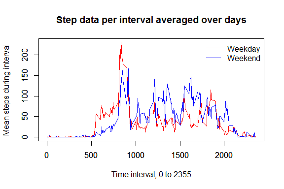

# Reproducible Research: Peer Assessment 1

Begin by setting options for numerical output.


```r
options(scipen=1,digits=2)
```

## Loading and preprocessing the data
We first load the data set, and transform the *interval* variable to a factor.

```r
setwd("C:/Users/Chris/Desktop/Coursera Reproducible Research")
predata <- read.csv("activity.csv")
predata$interval <- as.factor(predata$interval)
```

## What is mean total number of steps taken per day?
The data frame *stepdata* includes the total
number of steps taken on each date.  Values of *NA* are ignored; if all
values for a particular day have the value *NA*, then the day's total
is reported as 0.

```r
thedates <- levels(predata$date)
thesums <- as.numeric(tapply(predata$steps,
  predata$date,
  function(z) sum(z,na.rm=TRUE)))
stepdata <- data.frame(date=thedates,sums=thesums)
```
The histogram for the total number of steps taken, by day, is

```r
hist(stepdata$sums,breaks=15,col="red",
  main="Frequency of Number of Steps Per Day",
  xlab="Number of steps",ylab="Frequency")
```

 

*Note* - Normally I would not include the next chunk; I would have inlined the computations.  But the instructions did specify that all code appear, so voila...

```r
x1<-mean(stepdata$sums,na.rm=TRUE)
x2<-median(stepdata$sums,na.rm=TRUE)
```
The number of steps taken each day has a mean of 9354.23 steps and a median of 10395 steps.

## What is the average daily activity pattern?
The data frame *intervaldata* includes the average and standard deviation of the number of steps taken during each five minute time interval across all days.

```r
intervalID<-levels(predata$interval)
themeans <- as.numeric(tapply(predata$steps,predata$interval,
  function(z) mean(z,na.rm=TRUE)))
thedevs <- as.numeric(tapply(predata$steps,predata$interval,
  function(z) sd(z,na.rm=TRUE)))
intervaldata <- data.frame(id=intervalID, mean=themeans, dev=thedevs)
```
Over a day, the (mean) number of steps taken during each time interval is shown below.

```r
plot(as.numeric(as.character(intervaldata$id)),intervaldata$mean,type="l",
  xlab="Time interval, 0 to 2355",
  ylab="Mean steps taken during interval")
```

 

*Note* - Normally I would have hidden this next chunk.  I am simply computing a 24 hour format time, and the maximum number of average steps during intervals.


```r
x<-as.numeric(as.character(intervaldata$id[intervaldata$mean == max(intervaldata$mean)]))
hour <- floor(x/60)
minute <- round(((x/60) %% 1)*60)
maxsteps<-max(intervaldata$mean)
```

On average (over all days in the data set), the interval in which the greatest number of steps was taken has ID 835 corresponding to a time of approximately 13:55, with an average number of steps of 206.17.

## Imputing missing values

We compute the number of records with *NA* recorded for the number of steps.


```r
missinglength <- length(predata[is.na(predata)])
```

There are 2304 records with *NA*.  We will replace each *NA* value with the mean number of steps taken during that time interval across all days.

```r
data <- predata
data$record <- 1:nrow(data)
for (d in data$record) {
  if (is.na(data$steps[d])) {
    data$steps[d] <- intervaldata$mean[intervaldata$id == data$interval[d]]
  }
}
```
We can now perform the same data analysis on the new data set *data* that we did on the original set with missing values.

```r
thedates <- levels(data$date)
thesums <- as.numeric(tapply(data$steps,
  data$date,
  sum))
stepdata2 <- data.frame(date=thedates,sums=thesums)
```
The histogram for the total number of steps taken, by day, is

```r
hist(stepdata2$sums,breaks=15,col="red",
  main="Frequency of Number of Steps Per Day",
  xlab="Number of steps",ylab="Frequency")
```

 

The number of steps taken each day has a mean of 10766.19 steps and a median of 10766.19 steps.  We can see here that we raise the average number of total daily steps somewhat.  This is not unexpected; after all, in our first analysis, those days with all records being *NA* were treated as 0 in the total record, and thus contributed a 0 to the set of values being averaged, lowering the average a bit.

## Are there differences in activity patterns between weekdays and weekends?

To answer this question we first create a factor describing whether the records were collected on a weekday or a weekend.

```r
dayclassifier <- function(wd) {
  if (wd %in% c("Monday","Tuesday","Wednesday","Thursday","Friday")) {
    return("weekday")
  }
  else {
    return("weekend")
  }
}
dayclass <- lapply(weekdays(as.Date(as.character(data$date))),dayclassifier)
data$daytype <- as.factor(as.character(dayclass))
```
Next, we compute mean number of steps in each time interval, but once for weekdays and again for weekends.

```r
wdmeans <- as.numeric(tapply(data$steps[data$daytype=="weekday"],
  data$interval[data$daytype=="weekday"],
  mean))
wemeans <- as.numeric(tapply(data$steps[data$daytype=="weekend"],
  data$interval[data$daytype=="weekend"],
  mean))
```
Let's look at a plot of weekday and weekend mean number of steps.

```r
par(mfrow=c(2,1))
plot(intervalID,wdmeans,type="l",
  xlab="Time interval, 0 to 2355",
  ylab="Mean steps during interval",
  main="Weekday Data",
  ylim=range(wdmeans,wemeans),
  col="red")
plot(intervalID,wemeans,type="l",
  xlab="Time interval, 0 to 2355",
  ylab="Mean steps during interval",
  main="Weekend Data",
  ylim=range(wdmeans,wemeans),
  col="blue")
```

 

To compare on the same axes,


```r
plot(intervalID,wdmeans,type="l",
  ylim=range(wdmeans,wemeans),
  col="red",
  main="Step data per interval averaged over days",
  xlab="Time interval, 0 to 2355",
  ylab="Mean steps during interval")
par(new=TRUE)
plot(intervalID,wemeans,type="l",
  ylim=range(wdmeans,wemeans),
  col="blue",xlab="",ylab="")
legend("topright",c("Weekday","Weekend"), lty=c(1,1),
       col=c("red","blue"),bty="n")
```

 

This suggests a significant difference between behaviors on weekdays and weekends.  Not surprisingly, people seem to get up and moving earlier on weekdays than on weekends.
